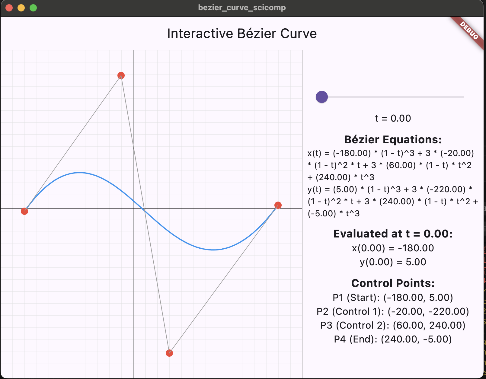

# Bézier Curve Interactive Visualization Playground

## Overview

This project provides an interactive visualization of cubic Bézier curves using Flutter. The application allows users to modify control points and endpoints, view the resulting curve, and understand how Bézier curves work by displaying their mathematical equations in real-time.

This project is inspired by concepts learned in Math 330, Section 3.5 on Bézier Curves, taught by Prof. Wanda Strychalski at Case Western Reserve University. It demonstrates the mathematical properties and computations behind Bézier curves while offering a UI to explore them dynamically. Cool 🚀 

## Demo
[Try it out!](https://bezier-curve-scicomp.web.app/)

## Mathematical Background

### What Are Bézier Curves?

A Bézier curve is a parametric curve frequently used in computer graphics, animations, and related fields to model smooth curves. In this project, we focus on cubic Bézier curves, which are defined by:

- **Two endpoints**: $(x_1, y_1)$ and $(x_4, y_4)$.
- **Two control points**: $(x_2, y_2)$ and $(x_3, y_3)$.

The control points influence the direction and curvature of the Bézier curve but are not points on the curve itself.

### Mathematical Equations

The cubic Bézier curve for $0 \leq t \leq 1$ is given by:

$$
x(t) = x_1 + b_x \cdot t + c_x \cdot t^2 + d_x \cdot t^3
$$
$$
y(t) = y_1 + b_y \cdot t + c_y \cdot t^2 + d_y \cdot t^3
$$

where:

$$
b_x = 3(x_2 - x_1), \quad c_x = 3(x_3 - x_2) - b_x, \quad d_x = x_4 - x_1 - b_x - c_x
$$
$$
b_y = 3(y_2 - y_1), \quad c_y = 3(y_3 - y_2) - b_y, \quad d_y = y_4 - y_1 - b_y - c_y
$$

This parameterization ensures a smooth curve between the endpoints, influenced by the control points' relative positions.

### Key Properties

- The slopes at the endpoints are controlled by the vectors connecting the endpoints to their respective control points.
- The curve is sensitive to user input through the scaling of derivatives by a factor of 3, enhancing its responsiveness to control point adjustments.

## Features of the Project

- **Interactive Curve Manipulation**: Users can drag the control points and endpoints to dynamically update the curve.
- **Real-Time Display of Equations**: The Bézier curve equations are displayed and updated as users modify the points.
- **Control Point Editing**: Users can click on control points to input precise coordinates, with validation to ensure proper input.
- **Grid and Axes**: A grid and x/y axes help users visualize the curve in a Cartesian coordinate system.

## Project Structure

### Core Components

1. **`Points.dart`**: A class representing a point with `x` and `y` coordinates.
2. **`BezierComputation.dart`**: Contains the logic to compute Bézier curve coefficients and evaluate points on the curve.
3. **`BezierCurve.dart`**: A class that models a Bézier curve using four points and offers methods to generate points along the curve.
4. **`BezierCanvasPainter.dart`**: A Flutter `CustomPainter` that draws the Bézier curve, grid, axes, and control points on a canvas.
5. **`screen.dart`**: The main UI screen that provides an interface for interacting with the curve.

## Code Explanation

### Computing Bézier Coefficients

The Bézier coefficients $b_x, c_x, d_x, b_y, c_y, d_y$ are computed based on the positions of the control and endpoint coordinates. This calculation ensures that the curve follows a smooth path influenced by the control points.

### Curve Evaluation

Given a parameter $t$ in the range $[0, 1]$, the coordinates $(x(t), y(t))$ of a point on the curve are computed using cubic polynomial interpolation. As users modify the control points, the curve updates in real-time based on the recalculated coefficients.

### User Interaction

- **Dragging Points**: Users can drag endpoints and control points to reshape the curve. The `GestureDetector` component handles user input, updating the curve accordingly.
- **Manual Input**: By clicking on a control point, users can manually input coordinates, with validation to ensure only numerical values are accepted.

## Example Usage

### Initial Configuration

Consider an example Bézier curve defined by the points:

- **Start Point**: $(-100, 0)$
- **Control Point 1**: $(-50, -50)$
- **Control Point 2**: $(50, 50)$
- **End Point**: $(100, 0)$

The curve will be drawn centered on the origin, with the control points influencing the shape. Users can modify these points to observe changes to the curve and corresponding equations.

### Real-World Applications

- Bézier curves are commonly used in font design, graphic animations, and modeling smooth paths.
- This project illustrates the underlying mathematics and provides an intuitive way to understand how control points influence curve shape.

## Acknowledgments

- **Prof. Wanda Strychalski**: For teaching the foundational concepts of Bézier curves in Math 330 at Case Western Reserve University.
- **Math 330 Material**: Reference material from Section 3.5 on Bézier curves, explaining the derivation and properties of cubic Bézier curves.
